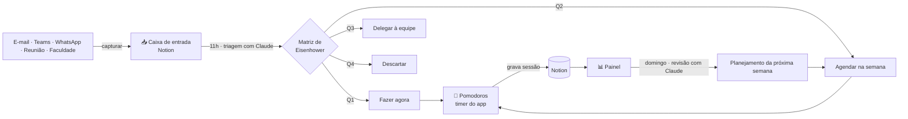
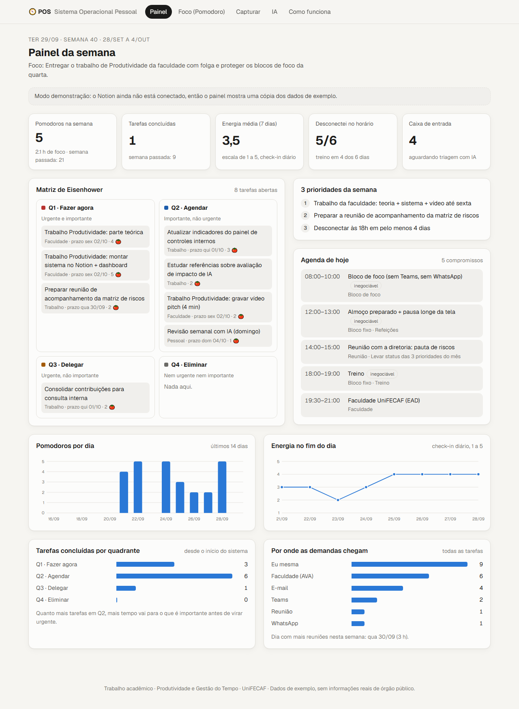
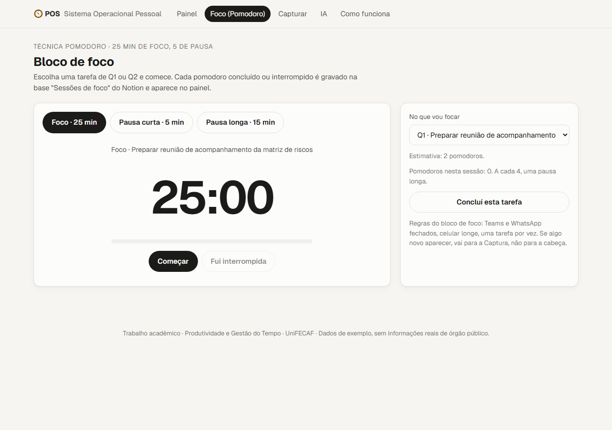
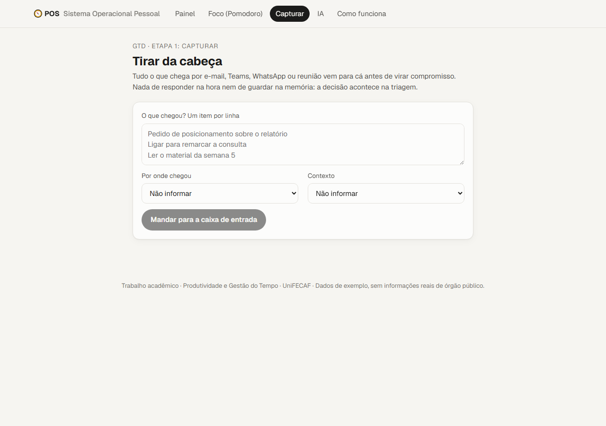
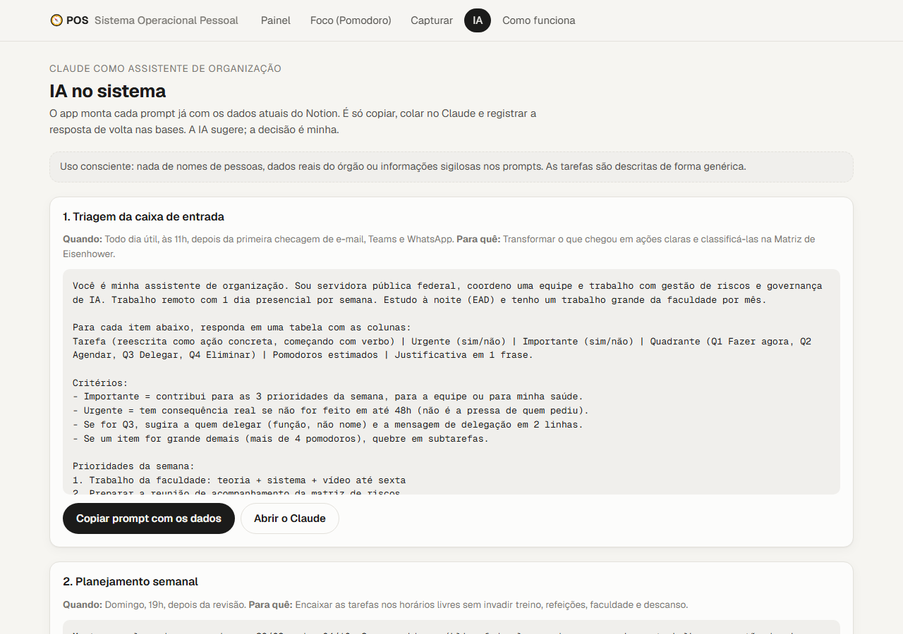
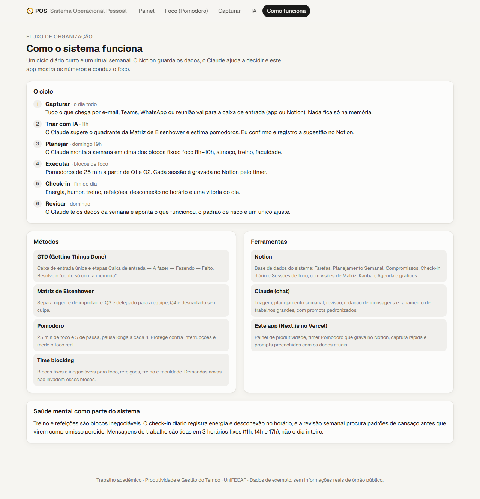
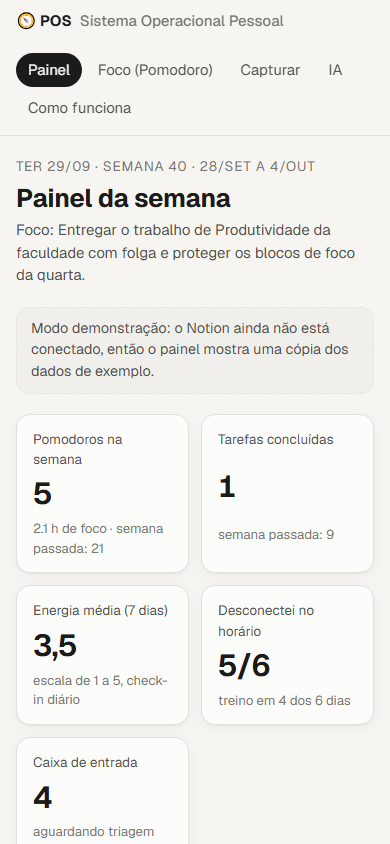

# 🧭 POS: Meu Sistema Operacional Pessoal

Sistema para organizar tempo, comunicação e produtividade usando **Notion**, **Inteligência Artificial (Claude)** e um **app web** com painel de acompanhamento e timer Pomodoro.

Trabalho da disciplina **Produtividade e Gestão do Tempo (UniFECAF)**.

- **App no ar:** https://pos-produtividade.vercel.app
- **Espaço no Notion:** *(link público do Notion aqui)*
- **Vídeo pitch:** *(link do vídeo aqui)*

> Todos os dados do sistema são de exemplo. Nenhuma tarefa, reunião ou pessoa real de órgão público aparece aqui.

---

## 1. Descrição do sistema

O problema: rotina de servidora pública federal com coordenação de equipe, muitas reuniões, demandas chegando ao mesmo tempo por e-mail, Teams e WhatsApp, faculdade EAD à noite e **nenhum sistema de organização além da memória**. O resultado era cansaço no fim do dia, compromissos perdidos e o trabalho da faculdade deixado para a última hora.

O POS resolve isso com três peças:

| Peça | Papel |
|---|---|
| **Notion** | Onde os dados moram: tarefas, planejamento semanal, compromissos, check-in diário e sessões de foco. |
| **Claude (IA)** | Ajuda a decidir: triagem da caixa de entrada, planejamento e revisão da semana, redação de mensagens e divisão de trabalhos grandes. |
| **App web (este repositório)** | Mostra os números (painel), conduz o foco (timer Pomodoro que grava no Notion), faz a captura rápida e monta os prompts de IA já preenchidos com os dados atuais. |

### Métodos aplicados

- **GTD (Getting Things Done):** uma caixa de entrada única e etapas `Caixa de entrada → A fazer → Fazendo → Feito`.
- **Matriz de Eisenhower:** toda tarefa recebe um quadrante. Q1 faz agora, Q2 agenda, Q3 delega para a equipe, Q4 elimina.
- **Pomodoro:** 25 min de foco, 5 de pausa, pausa longa a cada 4. Cada sessão é registrada.
- **Time blocking:** blocos inegociáveis para foco (8h–10h), almoço, treino e faculdade.

## 2. Ferramentas utilizadas

| Ferramenta | Por que foi escolhida |
|---|---|
| **Notion** | Bases de dados relacionadas, várias visões do mesmo dado (quadro, calendário, gráfico) e API aberta para o app ler e gravar. |
| **Claude (claude.ai)** | Bom com texto em português e com raciocínio sobre prioridades. Usado pelo chat, sem API paga, com prompts padronizados. |
| **Next.js + Vercel** | Painel web acessível do celular e do computador, publicado gratuitamente. |
| **API do Notion** | Liga o app às bases: leitura para o painel, escrita para sessões de foco e captura. |

### Estrutura no Notion

```
🧭 POS — Meu Sistema Operacional Pessoal
├── ✅ Tarefas                 Etapa (GTD), Quadrante (Eisenhower), Contexto, Origem, Prazo,
│                              Pomodoros estimados, Sugestão da IA, Semana, Sessões de foco
├── 📅 Planejamento Semanal    Período, Foco da semana, 3 prioridades, Revisão (IA),
│                              O que funcionou, O que ajustar
├── 🗓️ Compromissos            Quando, Tipo (reunião, bloco fixo, faculdade…), Inegociável
├── 🌿 Check-in diário         Energia (1–5), Humor, Treino, Refeições, Desconectei no horário,
│                              Pomodoros, Interrupções, Uma vitória do dia
├── 🍅 Sessões de foco         Início, Minutos, Tarefa, Concluída, Registrada por
├── 📊 Dashboard               Gráficos: energia, pomodoros, concluídas por quadrante, origem
└── 🤖 Prompts de IA (Claude)  Os 5 prompts padronizados
```

Visões criadas: **🎯 Matriz de Eisenhower** (quadro por quadrante), **📋 Fluxo GTD** (quadro por etapa), **📥 Caixa de entrada** (tabela) e **🗓️ Agenda** (calendário).

## 3. Fluxo de organização



| Quando | O que acontece |
|---|---|
| O dia todo | **Capturar**: o que chega vai para a caixa de entrada, sem responder na hora. |
| 11h | **Triagem com IA**: o Claude sugere quadrante e estimativa; eu confirmo. |
| 8h–10h e blocos livres | **Executar** em pomodoros, começando por Q1 e Q2. |
| 11h, 14h e 17h | Mensagens lidas em horários fixos, não o dia inteiro. |
| Fim do dia | **Check-in**: energia, humor, treino, refeições, desconexão. |
| Domingo | **Revisão** e **planejamento** da semana com IA. |

## 4. Como a IA foi usada

A IA entra como **assistente de decisão**, nunca como decisora. Os 5 prompts ficam no Notion e na página **IA** do app, onde já aparecem preenchidos com os dados atuais:

1. **Triagem da caixa de entrada**: reescreve cada item como ação, classifica em Eisenhower, estima pomodoros e, se for Q3, sugere a mensagem de delegação.
2. **Planejamento semanal**: encaixa as tarefas nos horários livres respeitando os blocos fixos e alerta sobre dias com excesso de reuniões.
3. **Revisão semanal**: lê tarefas, sessões e check-ins e aponta o que funcionou, o padrão de cansaço e um único ajuste.
4. **Comunicação**: transforma um rascunho em resposta curta e clara, negociando prazo quando necessário.
5. **Anti-procrastinação**: divide o trabalho grande do mês em entregas de até 2 pomodoros com data.

A justificativa de cada classificação fica registrada na coluna **Sugestão da IA** das tarefas.

**Uso consciente:** nenhum nome de pessoa, dado real do órgão ou informação sigilosa entra nos prompts.

## 5. Prints

### Painel da semana


### Bloco de foco (Pomodoro)


### Captura rápida


### Prompts de IA preenchidos com os dados


### Como funciona


### No celular


## 6. Como utilizar

### Uso diário

1. **Capturar**: em `/capturar`, escreva um item por linha e envie. Eles caem na caixa de entrada do Notion.
2. **Triar**: em `/ia`, copie o prompt de triagem, cole no Claude e registre o quadrante sugerido no Notion.
3. **Focar**: em `/foco`, escolha a tarefa e clique em **Começar**. Ao fim dos 25 min a sessão é gravada no Notion. Se for interrompida, clique em **Fui interrompida**.
4. **Check-in**: no fim do dia, preencha uma linha em **🌿 Check-in diário** no Notion.
5. **Acompanhar**: o painel (`/`) mostra pomodoros, tarefas concluídas, energia, desconexão e a Matriz de Eisenhower da semana.
6. **Domingo**: rode os prompts de revisão e de planejamento em `/ia`.

### Rodar o projeto

```bash
npm install
cp .env.example .env.local   # preencha NOTION_TOKEN e POS_PIN
npm run dev                  # http://localhost:3000
```

Sem `NOTION_TOKEN`, o app funciona em **modo demonstração** com uma cópia dos dados de exemplo.

### Conectar ao Notion

1. Em https://www.notion.so/profile/integrations, crie uma integração interna e copie o token.
2. Na página **🧭 POS** do Notion, abra `•••` → **Conexões** e adicione a integração (ela passa a enxergar as 5 bases).
3. Configure as variáveis no `.env.local` e no Vercel:

| Variável | Para quê |
|---|---|
| `NOTION_TOKEN` | Token da integração do Notion. |
| `POS_PIN` | PIN exigido para gravar no Notion pelo app (o site é público; sem o PIN ninguém grava). |
| `NOTION_DB_*` | Opcional. IDs das bases, se forem diferentes dos padrões em `lib/notion.ts`. |

### Estrutura do código

```
app/
  page.tsx              Painel da semana (indicadores, matriz, agenda, gráficos)
  foco/                 Timer Pomodoro
  capturar/             Captura rápida para a caixa de entrada
  ia/                   Prompts preenchidos com os dados do Notion
  como-funciona/        Fluxo, métodos e ferramentas
  api/sessao            Grava sessão de foco no Notion (exige PIN)
  api/capturar          Cria itens na caixa de entrada (exige PIN)
  api/tarefa            Marca tarefa como feita (exige PIN)
lib/
  notion.ts             Leitura e escrita na API do Notion
  metricas.ts           Cálculo dos indicadores
  prompts.ts            Montagem dos prompts de IA
  demo.ts               Dados de exemplo para o modo demonstração
components/             Gráficos, timer, captura, menu
```

## 7. Ganhos observados (semanas 39 e 40, dados de exemplo)

- Tudo registrado: 23 itens tirados da cabeça logo no primeiro dia.
- 21 pomodoros na primeira semana, com o relatório mensal entregue um dia antes do prazo.
- Trabalho da faculdade começado 5 dias antes do prazo, fatiado em partes.
- Energia média subiu de 3,0 para 4,0 entre o início da semana 39 e o início da semana 40.
- Desconexão no horário em 5 dos últimos 6 dias, com treino como fronteira do expediente.
